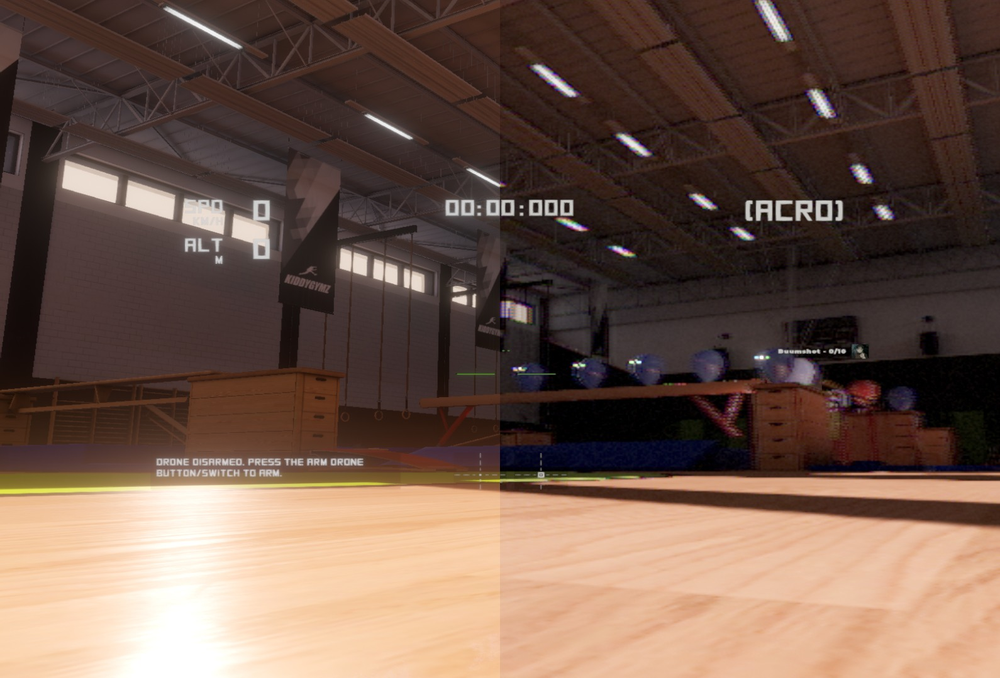
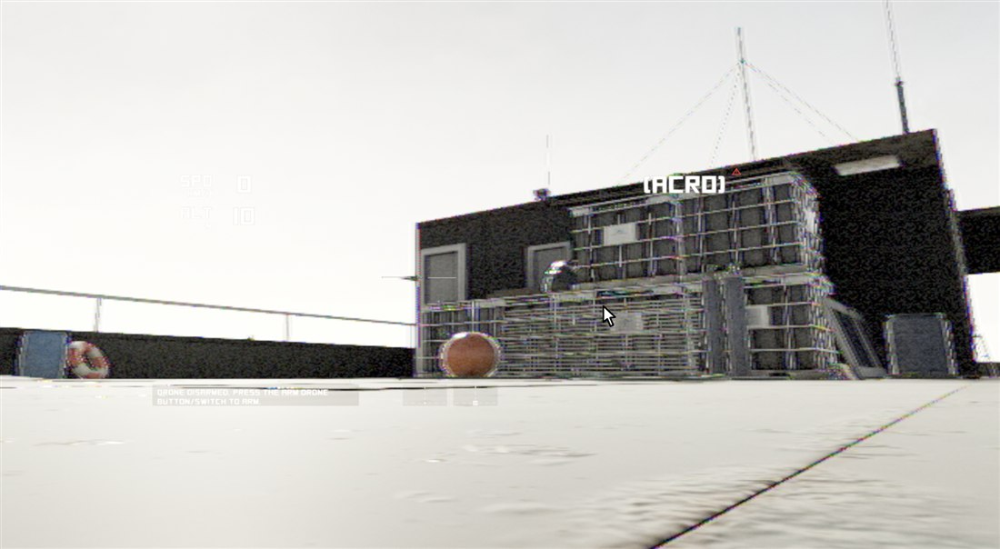
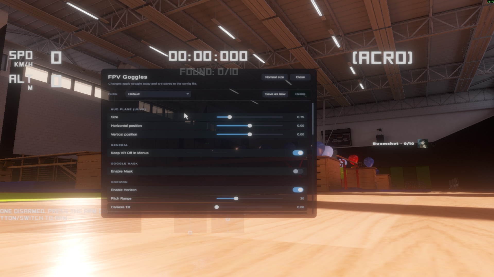

# Liftoff FPV Goggles

Turn a VR headset into a pair of FPV goggles for **Liftoff: Micro Drones**.

A BepInEx plugin that sits alongside [UUVR](https://github.com/Raicuparta/uuvr). UUVR gets the
game into a headset; this plugin makes it behave like goggles rather than like VR.



## Why

In VR the camera follows your head. Real goggles are a screen strapped to your face showing what
the drone's camera sees - turning your head changes nothing. Head tracking gives you a way to look
around that you will not have on the field, and it quietly makes the sim easier than the thing it
is simulating.

## What it does

* **No head tracking.** Rotation and position are ignored.
* **Menus stay flat.** VR is held off until you are in a flight, because Liftoff's menu is
  unusable in VR (see [Findings](#findings)).
* **Resizable HUD.** In a VR flight the game's HUD moves onto a plane you can size and position.
* **Betaflight-style artificial horizon.** A rolling bar with a fixed centre mark, compensated for
  the FPV camera's upward tilt. One key cycles its colour when the map swallows it.
* **Hide HUD elements** by name - the crosshair, the stick indicators, the recording icon, or all
  of it.
* **Settings menu you can use with the headset on.** `F10`, then the mouse. See
  [Settings menu](#settings-menu).
* **Profiles.** Save a set of settings, switch between them. See [Profiles](#profiles).



* **Real composite video.** The picture is encoded into an analog signal, spoiled, and decoded
  again. Dot crawl, rainbow patterns, colour smear and colour dying before the picture does are
  not drawn on - they are what is left over. See [Composite Video](#composite-video).
* **A radio link that behaves like one.** Snow rises with distance, a building between you and the
  drone costs you the picture, a level drone overhead sits in the antenna's null. See
  [Analog Video](#analog-video-optional-off).
* **Camera and lens.** Washed-out colour, chroma fringing, barrel distortion, blown highlights,
  gain hunting for an exposure. See [Analog Image](#analog-image).

Optional, off by default:

* **Goggle mask** - a black border cutting the picture down to a real goggle's field of view.

## Requirements

| | |
|---|---|
| Game | Liftoff: Micro Drones (tested against build 1.1.1, Unity 2022.3) |
| Mod loader | BepInEx 5 (x64, Mono) |
| Dependency | UUVR 0.4.0 (`raicuparta.uuvr-modern`) - hard dependency |
| Easiest setup | [Rai Pal](https://github.com/Raicuparta/rai-pal) installs both for you |

Tested with a Meta Quest 2 over Link and SteamVR (UUVR set to OpenVR).

## Installation

**First, get UUVR running.** This plugin does nothing on its own.

1. Install [Rai Pal](https://github.com/Raicuparta/rai-pal).
2. Find *Liftoff: Micro Drones* in it and install **UUVR Mono Modern**.
3. Start the game once and check that it reaches the headset. If UUVR does not work for you,
   nothing here will either.

**Then add this plugin.**

1. Download the release ZIP from [Releases](../../releases) and extract it anywhere.
2. Right click `install.ps1` → **Run with PowerShell**.

If Windows blocks it:

```powershell
powershell -ExecutionPolicy Bypass -File .\install.ps1
```

<details>
<summary>Installing by hand instead</summary>

Copy `LiftoffFpvGoggles.dll` and `fpvanalog` into the BepInEx folder Rai Pal created for Liftoff:

```
%APPDATA%\raicuparta\rai-pal\data\installed-mods\<game id>\bepinex\BepInEx\plugins\LiftoffFpvGoggles\
```

The `<game id>` is a long number - pick the folder that already contains
`plugins\uuvr-mono-modern`.
</details>

To remove it: `.\install.ps1 -Uninstall`. Your settings file stays.

> Rai Pal overwrites the plugins folder when it reinstalls UUVR. If the plugin disappears, run
> `install.ps1` again.

## Flying

1. **Start the game.** It runs flat, VR is off.
2. **Pick a track and start the flight.**
3. **Press `F3`.** VR switches on with the view locked to the drone.

`F3` is UUVR's key, not this plugin's. Leaving a flight switches VR back off.

## Hotkeys

| Key | Action |
|---|---|
| `F3` | VR on/off (UUVR's key) |
| `F6` | Analog video on/off |
| `F9` | Horizon colour: white → green → red → yellow → off |
| `F10` | Settings menu |

Everything else is unbound. HUD size and position, the goggle mask, the horizon size - all of it
used to have a key, and the menu is a better place for it. The bindings are still in the config
file if you want them back.

Keys go through `GetAsyncKeyState`, as UUVR does it, so they work whatever input system the game
uses. **The game receives the same press** - `F4`, `F5`, `F11` and `F12` toggle Liftoff's own HUD
and are left free here. All goggle keys are ignored in menus.

`F6` is session-only and never written to the config file; a quick A/B during one flight should
not become the permanent setting. The horizon colour *is* saved.

## Settings menu



`F10` in a flight, then click. Rows are built from the settings file rather than listed by hand,
so the menu cannot fall behind the settings. Changes apply as you make them.

**Read it** doubles the HUD plane while the menu is open and puts it back on close. **Close** is
also `F10` again.

Rows come and go with what they depend on - switch composite video off and the settings it owns
disappear, because a slider that currently changes nothing reads as a broken mod.

Key bindings and the head tracking switches are deliberately not in the menu. A slider cannot
express a key, and turning head tracking back on mid-flight is not a mistake worth making easy.

### Profiles

A profile is a named copy of everything the menu shows, kept in
`BepInEx\config\maxwo.liftoff.fpvgoggles.profiles.cfg`.

| | |
|---|---|
| **Default** | Not a stored profile - what the mod ships with. Choosing it is the reset button. |
| **Save as new** | Shown while Default is selected. Starts a numbered profile. |
| **Save** | Overwrites the selected profile. |
| **Delete** | Removes it and goes back to Default. |

Numbered rather than named because there is no keyboard in a headset. Rename a profile by editing
its heading in the file.

A profile holds what the panel shows plus the HUD plane's size and position - not key bindings,
not the hidden HUD elements, not the head tracking switches. Loading one starts from the defaults
and applies the profile over them, so a profile written before a setting existed leaves it at its
default.

## Configuration

`BepInEx\config\maxwo.liftoff.fpvgoggles.cfg`, written on first start. Every key can be rebound
there; function keys, arrows, the numeric keypad and the navigation block are all available.

### General

| Setting | Default | Meaning |
|---|---|---|
| `Keep VR Off In Menus` | `true` | Holds VR off in menus. |
| `Menu Scene Names` | `menu,splash,lobby,loading` | Comma separated. A scene counts as a menu if its name contains any of these. |
| `Settings Menu Key` | `F10` | Opens the menu. |
| `Active Profile` | *(empty)* | Last profile chosen. Empty means the shipped defaults. |

Scene detection is the hinge everything hangs off: VR on/off, the HUD capture mode, whether the
goggle keys do anything. The active scene name is logged on every change, so unusual game modes
can be added to the list.

### Head Tracking

| Setting | Default | Meaning |
|---|---|---|
| `Disable Head Rotation` | `true` | The core setting. |
| `Disable Head Position` | `true` | Leaning no longer shifts the camera. |

### HUD

| Setting | Default | Meaning |
|---|---|---|
| `HUD On VR Plane In Flight` | `true` | Puts the HUD on UUVR's UI plane so it can be resized. |
| `Hide Elements` | *(empty)* | Comma separated object names. Exact match, case insensitive; `*` for substring matching. |
| `Dump HUD Tree Key` | `None` | Writes the HUD hierarchy to the log so you can find names. |

Useful names in Liftoff: `Center` (the crosshair), `ArmedDisplay` (crosshair plus drone name),
`AxisVisualizer` (the stick crosses), `RecordingIndicator`, `XSDroneHUD` (everything).

> Elements that only appear once the drone is armed are only in the dump if you dump **while
> armed**. The crosshair is one of them.

### Horizon

| Setting | Default | Meaning |
|---|---|---|
| `Enable Horizon` | `true` | Betaflight-style artificial horizon. |
| `Camera Tilt` | `0` | Upward tilt of the FPV camera in degrees, as set in Liftoff. |
| `Pitch Range` | `30` | Degrees of pitch from centre to the top edge. Larger = calmer. |
| `Scale` | `0.5` | Master size. Also scales how far the bar travels. |
| `Colour` | `White` | White, Green, Red, Yellow or Off. `F9` cycles it. |
| `Bar Width`, `Centre Gap`, `Line Thickness` | | Shape of the indicator. |

No single colour works everywhere - white vanishes against a bright sky or a concrete hall, and
the map decides that, not you. Hence the cycle key, with `Off` as part of the cycle.

`Camera Tilt` is worth a note. A real OSD draws the **craft's** attitude and knows nothing about
the camera angle. Set this to your in-game camera angle and the bar behaves the same way: centred
when the drone is level, and therefore not sitting on the visible horizon. Leave it at `0` to have
it line up with what you see instead.

### Analog Video *(optional, off)*

Three layers over the picture, in the order a real signal picks them up: the **lens** vignettes,
the **radio link** adds snow, the **goggle screen** draws it as scanlines.

| Setting | Default | Meaning |
|---|---|---|
| `Enable Analog Video` | `false` | The whole feature. |
| `Signal Range` | `250` | Metres at which the picture is about gone. |
| `Static Strength` | `0.55` | How heavy the snow gets once the link is lost. |
| `Base Grain` | `0.02` | Grain that stays at full signal. |
| `Scanline Strength` / `Scanline Count` | `0.15` / `240` | Darkness and number of lines. |
| `Vignette Strength` | `0.30` | Corner darkening. |
| `Obstacles Block Signal` | `true` | Line-of-sight check between you and the drone. |
| `Antenna Null` | `true` | A level drone directly overhead is the worst spot. |
| `Signal Breakup` | `true` | Short bursts with a rolling sync bar. |
| `Log Signal` | `false` | Link quality and distance to the log every two seconds. |

The point is not the effect but **when** it happens. Random static is seen through in two minutes;
static that arrives because you went behind a building is what you recognise from flying. The
pilot's position is taken from where the drone spawns, and three things drive the model:

* **Distance.** Clean out to about a third of `Signal Range`, then falling away.
* **Line of sight.** A `Physics.Linecast` from head height to the drone, ten times a second.
  Blocked costs most of the picture and comes back slower than it went.
* **Antenna orientation.** A dipole radiates nothing along its own axis. Weighted by distance,
  because close in there is signal to spare.

`Signal Range` is the one worth tuning. `250` is middle of the road; a 25 mW whoop on its stock
antenna behaves more like `120`, a decent 400 mW setup several times that. Turn on `Log Signal`,
fly out, set it to match your own gear.

With composite video on, the static and scanlines here switch themselves off - they were standing
in for a signal that is now being decoded for real.

### Composite Video

The picture is encoded into one analog signal, brightness with the colour riding on a subcarrier.
Noise is mixed into **that**, and it is decoded again. Dot crawl, rainbow patterns, colour smear
and colour dying before the picture does are written nowhere in the shader; they fall out of doing
the real thing badly.

Ships as a compiled shader in `fpvanalog`, next to the plugin DLL.

| Setting | Default | Meaning |
|---|---|---|
| `Enable Composite Video` | `true` | The whole section. |
| `Signal Lines` | `1000` | Lines in the emulated signal, and the resolution the decode runs at. |
| `Subcarrier Frequency` | `227.5` | Cycles per line. The real NTSC figure. |
| `Signal Noise` | `0.18` | Noise mixed into the signal once the link is gone. |
| `Line Jitter` | `0.004` | How far lines slide sideways, as a fraction of the width. |
| `Chroma Bleed` | `0.8` | How much wider the colour smears than the brightness. |
| `Chroma Gain` | `1` | Gain on the decoded colour. |
| `Softness` | `0` | How much brightness detail is given up. |
| `Affects HUD` | `false` | On, the HUD and horizon go through the link too. |

**`Signal Lines` is not 480 on purpose.** Analog video has 480 lines, but they fill a 46° goggle -
about ten lines per degree. A headset spreads the picture over roughly a hundred degrees, so 480
would look half as sharp as the real thing. A thousand matches the angular sharpness. Switch the
goggle mask on and 480 is right again.

It is also the frame rate knob: the decode runs at this resolution rather than the headset's.

> Two things to get right if you build on the shader. Colour is **band-limited before it is
> modulated**, as a real encoder does - skip that and full-detail colour lands back in the
> brightness one subcarrier period away, which shows as every edge doubled. And brightness is
> recovered by **subtracting the decoded colour from the untouched signal**, not by averaging:
> averaging is a twelve-pixel blur, subtraction is sharp and leaves the dot crawl where it belongs.

### Analog Image

Colour, lens shape, blown highlights, exposure - the half that needs the rendered image read back.
Runs through **Liftoff's own copy of Post Processing Stack v2**, so it needs no custom shader.

| Setting | Default | Meaning |
|---|---|---|
| `Enable Image Processing` | `true` | The whole section. Needs `Enable Analog Video` too. |
| `Saturation` | `-20` | Colour at full signal. |
| `Colour Loss` | `1` | How much colour dies with the signal. |
| `Contrast` | `10` | Analog is contrastier, and loses the shadows for it. |
| `Colour Temperature` | `10` | White balance. Cheap cameras run warm. |
| `Chromatic Aberration` | `0.35` | Colour fringing at edges. |
| `Lens Distortion` | `-20` | Barrel distortion. Negative bulges outwards. |
| `Bloom` | `0.45` | How hard bright spots blow out. `0` switches the pass off. |
| `Auto Exposure` | `true` | Gain hunting for an exposure when you pitch into the sky. |

The split between this section and the two above: **the radio link is done for real by the
composite pass, the camera and the lens live here.** Where they overlap the composite pass wins -
`Colour Loss` and `Chromatic Aberration` do nothing while it runs.

`Colour Loss` still matters with composite video off. On a real link the chroma subcarrier dies
before the luma, so a fading picture goes black and white while staying readable, and the colour
coming back is how you know you are clear again.

> Post processing at headset resolution is not free, and the composite pass runs before it - its
> noise goes through the bloom too. If the frame rate suffers: `Signal Lines` down first, `Bloom`
> to `0` second, `Auto Exposure` off third.

### Goggle Mask *(optional, off)*

A black border restricting the picture to a real goggle's field of view. Default 46° diagonal at
4:3, a Skyzone SKY04O Pro on analog. With it on, the analog artefacts stop at the border.

It cuts a hole into a picture still rendered at **headset** field of view: you see less of the
world at the same scale. It does not reproduce a wide angle lens squeezed onto a small screen.

## Findings

Notes from getting this to work.

### Liftoff destroys injected GameObjects

The log says `Custom code injection detected`. The BepInEx manager object a `BaseUnityPlugin` lives
on is not spared, so the whole `Update()` loop dies at startup while Harmony patches keep working,
because they are static. From the outside half the mod silently does nothing.

UUVR recreates itself in `UuvrCore.OnDestroy()`, and so does this plugin. Two corollaries:

* **Do not use `ConfigFile.SettingChanged`.** The component gets destroyed, `OnDestroy`
  unsubscribes, and nothing notices config changes afterwards. Poll instead.
* **Do not cache objects from UUVR.** Its core rebuilds constantly. A held `VrToggler` becomes a
  dead object whose state disagrees with the live one, which made `F3` toggle backwards.

### The VR menu cannot be fixed from here

| | Resolution | Aspect |
|---|---|---|
| Game window | 1920 × 1080 | 1.78 |
| XR eye texture | 2544 × 2564 | 0.99 |

UUVR's capture camera renders into a near-square target while the menu is laid out for 16:9, so
only part of it is captured. Scaling does not help - the crop scales with it, because it happens at
capture time. Neither does head movement: UUVR pins the menu plane to the camera via
`FollowTarget`. Hence holding VR off in menus entirely.

### The HUD capture mode has to switch automatically

| Mode | Effect |
|---|---|
| `None` | No UI on the VR plane |
| `Mirror` | A copy of the **whole screen** on the plane, on top of the world |
| `CanvasRedirect` | Only the canvases - the HUD, resizable |

`CanvasRedirect` is right during a flight but must not stay on outside one: it re-parents the
canvases to UUVR's capture camera with `RenderMode.ScreenSpaceCamera`, and when that camera is not
rendering the menu is invisible, flat screen included. So the plugin sets it itself.

### Check what the game already ships before writing a shader

The first version of the analog look was quads only, assuming anything needing the rendered image
back would require a custom shader. Checking took two minutes:

```
Liftoff Micro Drones_Data\Managed\Unity.Postprocessing.Runtime.dll     ← present
Assembly-CSharp.dll references Unity.Postprocessing.Runtime            ← the game uses it
no URP, no HDRP runtime                                                ← built-in pipeline
```

The second line is the one that matters. Unity strips shaders nothing references, so a package
being present is not enough - it has to be *used*. Because Liftoff grades with PPv2, every effect
shader is in the build, and a plugin gets colour grading, chromatic aberration, lens distortion,
bloom and auto exposure through `PostProcessManager.QuickVolume`.

Adding a `PostProcessLayer` to a camera yourself:

* `AddComponent` runs `OnEnable` before you can call `Init(resources)`. Toggle `enabled` off and on
  afterwards so it initialises against the resources instead of against null.
* Do **not** override `gradingMode`. The game may be grading in HDR with a tonemapper, and forcing
  LDR throws its look away. Saturation, contrast and white balance apply in either.

### Building a shader bundle

`fpvanalog` is built from [unity/](unity/) by [build-bundle.ps1](build-bundle.ps1), which drives
Unity in batch mode. It is committed, so a normal `build.ps1` needs no Unity.

* **Match the game's Unity version.** Liftoff is on 2022.3.62f3 - it is in
  `<game>_Data/globalgamemanagers` as plain text near the start. An older 2022.3 patch is safe, a
  newer one is the direction that breaks.
* **Unity Personal is free but must be activated.** Installing the editor without Unity Hub leaves
  it unlicensed, and the only symptom is `No valid Unity Editor license found`.
* **A shader that fails to compile still gets packed**, and the mod then loads a shader that draws
  nothing. `ShaderUtilities.ShaderHasError` in the build script catches it.
* **`line` is a reserved word in HLSL**, and the error points at the line after the one that is
  wrong.

Plugging the effect in is reflection into PPv2, not a render hook: a settings class with
`[PostProcess(typeof(Renderer), PostProcessEvent.…)]` plus a nudge to re-scan the assemblies,
because the stack looks for effect types exactly once and BepInEx may load after it. The stage is
baked into the attribute, so covering both "before transparent" and "after everything" takes two
types.

### A bug in UUVR that only shows when settings change quickly

`CanvasRedirect.ShouldPatchCanvas` decides whether a screen space camera canvas belongs on the VR
plane by asking whether it renders into a texture. It asks the canvas **as it stands** - and once
redirected, its camera *is* the capture camera, which renders into a texture. So the answer flips,
the game's HUD is dropped off the plane, and the next change puts it back.

One flicker per setting change is easy to miss. A slider writing a setting every frame turns it
into a strobe, which is how this was found.

The fix corrects the question, not the answer: while the check runs, the canvas is handed back the
camera it had before redirection, and gets the capture camera back straight after. Nothing renders
in between - it is one synchronous call - and UUVR's own decision is untouched.

Only canvases whose **original** render mode was `ScreenSpaceCamera` are affected, which is why the
settings panel sat still while the HUD blinked next to it.

### Alpha does not survive a render texture

Unity's UI blend is `SrcAlpha OneMinusSrcAlpha` for the alpha channel as well as the colour. Into
an empty texture that squares it: a layer drawn at 0.97 leaves 0.94 behind, and every layer on top
takes another bite.

The settings panel goes into UUVR's capture texture before it reaches the plane. At 97% with row
plates at 3.5% over it, it came out as a grey wash - and the **row plates were lighter than the
panel they sat on**, which is the giveaway. A filter would have hit both equally.

Staggering the alphas cancels it exactly: panel at the square root of the opacity you want,
everything above at that opacity. `sqrt(t)` squared is `t`, and a layer at `t` over an accumulated
`t` leaves `t*t + t*(1-t)`, which is `t` again. Not used here in the end - 12% of a bright hangar
through a dark panel reads as grey paint rather than glass.

### Render queues, and who is on top of whom

| | Queue |
|---|---|
| Goggle mask | 5000 |
| UUVR's UI plane | 5000 (its own `VR UI Render Queue` setting) |
| Analog overlay layers | 5002 - 5005 |
| Horizon indicator | 6006 / 6007 |

The settings panel is drawn onto that plane, so the analog overlay was painting over it - by two
queue counts - and the horizon crossed it. **Canvas sorting order cannot answer either**: it only
orders canvases against each other, and both of those are meshes. While the panel is open both drop
below the plane's queue, which is read off the plane rather than assumed.

The plane is also depth tested like any other quad, so with the drone on the ground and the camera
tilted down, the floor cuts the bottom off the panel. Its depth test comes off while the menu is
open, re-applied every frame: UUVR reassigns the plane's shader on every setting change and
`unity_GUIZTestMode` is not a declared property, so it does not survive.

### Odds and ends

* UUVR's `Camera Position Offset X` can be written but has no effect; `VrCameraOffset
  .OnSettingChanged` never sees the event.
* UUVR forces a software cursor. `Mirror` captures it because it copies the screen;
  `CanvasRedirect` does not, because a software cursor is not a canvas. It is re-applied from
  `VrUiCursor.Update` every frame for the whole session, so outside VR it is both the wrong pointer
  and a needless cost. This plugin switches that component off when it is not in a VR flight.
* Liftoff uses Rewired, so `UnityEngine.Input` is not an option for hotkeys.
* **Not every shader can be told to ignore depth.** `Sprites/Default` has no depth control at all:
  no `_ZTest` property, and it does not read `unity_GUIZTestMode` either. Setting both is silently
  ignored, and the overlay ends up drawn on distant scenery only. `UI/Default` declares
  `ZTest [unity_GUIZTestMode]` and `Hidden/Internal-Colored` has a real `_ZTest`.
  `Canvas.GetDefaultCanvasMaterial()` is a guaranteed way to the former.
* Moving a quad in front of the near clip plane dodges the depth test and is the wrong fix in VR:
  at a few centimetres the eyes can no longer fuse it.
* Overlay quads are wound one way only. Winding both ways to defeat backface culling doubles the
  strength of a transparent quad, because the second pass blends on top of the first.
* `Sprites/Default` multiplies by the vertex colour, and a mesh with no colour stream can arrive as
  transparent black - an invisible layer with no error anywhere.
* **Put colour in the mesh, not on the material.** `Hidden/Internal-Colored`, which is what the
  horizon indicator gets in Liftoff, has no `_Color` property and returns the vertex colour. It was
  only white because Unity feeds white for a missing colour stream. `mesh.colors32` works whatever
  shader you land on.
* Post processing runs after **everything**, overlay quads included. Bright static crossing the
  bloom threshold turns the picture into grey haze, so the threshold has to sit above 1.
* **uGUI draws nothing but hard cornered boxes without a sprite.** Rounded panels, pill switches
  and thin slider bars come from one procedural texture per radius, stretched by nine slice
  scaling. `SpriteMeshType.FullRect` matters: a tight mesh trims the transparent corners away and
  the borders then describe a rectangle that is no longer there.
* **Unity's `Dropdown` is unusable on a redirected canvas.** It builds a canvas for the popup plus
  a full screen blocker canvas, and every canvas has to be collected by UUVR before it is visible.
  The profile chooser draws its list inside the panel instead.
* A glyph missing from the font atlas renders as a hollow box, which looks like a bug. The triangle
  on that chooser is eleven by six pixels of drawn texture rather than a character.
* A class with its own `Toggle()` method cannot write `Toggle.ToggleTransition.None`: when a method
  and a type share a name, the method wins.

## Known limitations

* **Tied to UUVR internals.** Several settings are driven through reflection into UUVR's
  `ModConfiguration`. A UUVR update can break this. Tested against 0.4.0.
* **The analog image needs the game's post processing package.** Without it that half switches
  itself off with a warning and the overlay carries on alone.
* **Both eyes see a stereo image.** Real goggles show one camera to both eyes. More comfortable
  this way, less accurate.
* **Switching VR off mid-flight does not fully undo it.** The analog look goes, the HUD keeps the
  size and position UUVR gave it. `CanvasRedirect.UndoPatch` restores three of the four values it
  records and only reaches components that still exist. Leave the flight instead.
* **The HUD text has no outline.** Liftoff draws it plain white, which disappears against a bright
  sky with the analog processing on. TextMeshPro's outline works on the menu font and not on the
  HUD's segmented face, whose atlas has no padding for an edge to grow into. A black copy drawn
  behind each label was tried and dropped: text, position and size are written at different points
  in Unity's frame with no ordering guarantee for a plugin. Hide the parts you do not need instead.
* **Liftoff specific.** Scene names and HUD element names come from this game.
* **The desktop window is black while VR is on.** That is UUVR.
* Only tested on Windows, with SteamVR and a Quest 2.

## Building

```powershell
.\build.ps1
```

No .NET SDK required - it uses `csc.exe` from the .NET Framework that ships with Windows. That
compiler only speaks **C# 5**: no `nameof`, no string interpolation, no `?.`.

Game and BepInEx folders are detected automatically. Override them if needed:

```powershell
.\build.ps1 -GameDir "D:\Games\Liftoff Micro Drones" -BepInExDir "C:\...\bepinex\BepInEx"
```

The script writes `Local.props`, which [LiftoffFpvGoggles.csproj](LiftoffFpvGoggles.csproj) imports,
so `dotnet build` and IntelliSense work without machine specific paths in version control. With the
SDK you get modern C# instead of C# 5.

`.\package.ps1` builds and packs a release ZIP into `dist\`.

### The shader

`assets\fpvanalog` is committed, so the above needs no Unity. Rebuild it only when the shader
changes:

```powershell
.\build-bundle.ps1
```

It finds a Unity 2022.3 editor and drives it in batch mode. See
[Findings](#building-a-shader-bundle).

### Layout

| File | Contents |
|---|---|
| [src/FpvGogglesPlugin.cs](src/FpvGogglesPlugin.cs) | Settings, Harmony patch, key codes |
| [src/FpvGogglesRunner.cs](src/FpvGogglesRunner.cs) | Everything per frame: VR control, scenes, hotkeys, mask |
| [src/HorizonIndicator.cs](src/HorizonIndicator.cs) | Artificial horizon |
| [src/AnalogOverlay.cs](src/AnalogOverlay.cs) | Overlay artefacts and the radio link model |
| [src/AnalogPostFx.cs](src/AnalogPostFx.cs) | Camera and lens, through the game's post processing |
| [src/CompositeVideo.cs](src/CompositeVideo.cs) | The composite pass and its shader bundle |
| [src/SettingsMenu.cs](src/SettingsMenu.cs) | The settings panel, built from the config entries |
| [src/SettingsProfiles.cs](src/SettingsProfiles.cs) | Reading and writing profiles |
| [src/UuvrCanvasFix.cs](src/UuvrCanvasFix.cs) | The Harmony patch for the canvas flicker above |
| [unity/Assets/Shaders/FpvComposite.shader](unity/Assets/Shaders/FpvComposite.shader) | The encode and decode |

The plugin is compiled against the **game's** assemblies (.NET Standard 2.1), not the compiler's
framework - hence `/nostdlib+` plus Unity's `mscorlib` and `netstandard`. Without it the build
fails with `CS0012: System.Object ... netstandard 2.1`. The resulting DLL referencing mscorlib in
two versions is normal: the 2.0.0.0 references come from Harmony's and BepInEx's signatures, and
Mono resolves by simple name.

## Credits

Built on [UUVR](https://github.com/Raicuparta/uuvr) by Raicuparta, which does the actual work of
getting a flat Unity game into a headset. This plugin only bends it towards FPV.

## License

MIT - see [LICENSE](LICENSE).
