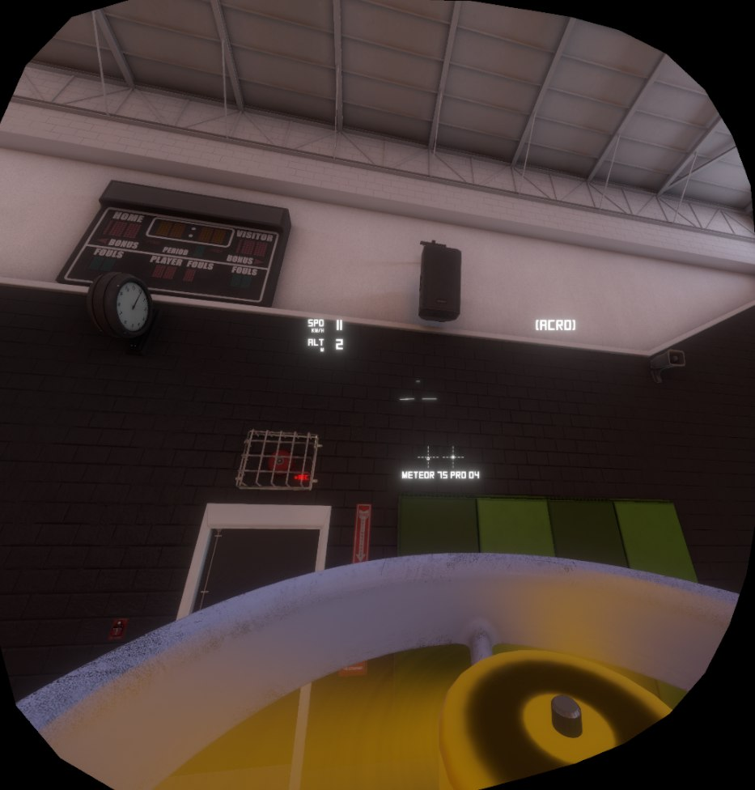

# Liftoff FPV Goggles

Turn a VR headset into a pair of FPV goggles for **Liftoff: Micro Drones**.

A BepInEx plugin that sits alongside [UUVR](https://github.com/Raicuparta/uuvr). UUVR gets the
game into a headset; this plugin makes it behave like goggles rather than like VR.



*Mid-flight, seen through the headset. Speed and altitude sit on their own resizable plane, and
the artificial horizon is the short bar above centre with the fixed mark below it — the drone
is banked slightly left. Turning your head changes none of this. This one is a single-eye
SteamVR mirror capture, which is why the lens shape is visible; in the headset it fills your
view.*

## Why

In VR, the game camera follows your head. Real FPV goggles do not: they are a screen strapped
to your face showing whatever the drone's camera sees. Turning your head changes nothing.

That difference matters. Head tracking gives you a way to look around that you will not have
on the field, and it quietly makes the sim easier than the thing it is simulating.

## What it does

* **No head tracking.** Rotation and position are ignored. The picture is locked to the drone.
* **Menus stay flat.** VR is held off until you are in a flight, because Liftoff's menu is
  unusable in VR (see [Findings](#findings)). Everything up to the start of the flight behaves
  as if no mod were installed.
* **Resizable HUD.** In a VR flight the game's HUD moves onto a plane you can size and
  position, instead of being smeared across the whole field of view.
* **Betaflight-style artificial horizon.** A rolling bar with a fixed centre mark, with
  compensation for the FPV camera's upward tilt — the way a real OSD behaves. Cycle its colour
  with one key when the map swallows it.
* **Hide HUD elements.** Drop the crosshair, the stick indicators, the recording icon, or the
  entire HUD, by name.


*The same picture with composite video on. Look at the scaffolding: colour running off the edges
of every bar, speckle in the dark faces, and the whole thing softened to about the resolution an
analog link actually carries. None of that is drawn on — it is what survives being encoded into
one signal and decoded again.*

* **Real composite video.** The picture is encoded into an analog signal, spoiled, and decoded
  again — so dot crawl, rainbow patterns on fine detail, sideways colour smear and colour dying
  before the picture does are not drawn on, they are what is left over. See
  [Composite Video](#composite-video).
* **A radio link that behaves like one.** Snow rises with distance, going behind a building
  costs you the picture, and a level drone directly overhead sits in the antenna's null. See
  [Analog Video](#analog-video-optional-off).
* **Camera and lens.** Washed-out colour, chroma fringing, barrel distortion, blown highlights
  and gain hunting for an exposure, through the game's own post processing. See
  [Analog Image](#analog-image).

Optional, off by default:

* **Goggle mask** — a black border cutting the picture down to a real goggle's field of view,
  which also becomes the area the analog artefacts are drawn on.

## Requirements

| | |
|---|---|
| Game | Liftoff: Micro Drones (tested against build 1.1.1, Unity 2022.3) |
| Mod loader | BepInEx 5 (x64, Mono) |
| Dependency | UUVR 0.4.0 (`raicuparta.uuvr-modern`) — hard dependency, the plugin will not load without it |
| Easiest setup | [Rai Pal](https://github.com/Raicuparta/rai-pal) installs both for you |

Tested with a Meta Quest 2 over Link and SteamVR (UUVR set to OpenVR).

## Installation

**First, get UUVR running.** This plugin does nothing on its own.

1. Install [Rai Pal](https://github.com/Raicuparta/rai-pal).
2. Find *Liftoff: Micro Drones* in it and install the mod **UUVR Mono Modern**.
3. Start the game once through Rai Pal and check that it reaches the headset. If UUVR does not
   work for you, nothing here will either.

**Then add this plugin.**

1. Download the release ZIP from [Releases](../../releases) and extract it anywhere.
2. Right click `install.ps1` → **Run with PowerShell**.

The script finds Rai Pal's BepInEx folder by itself and tells you what to do next. If Windows
blocks it, open a PowerShell window in the extracted folder and run:

```powershell
powershell -ExecutionPolicy Bypass -File .\install.ps1
```

<details>
<summary>Installing by hand instead</summary>

Copy `LiftoffFpvGoggles.dll` into the BepInEx folder Rai Pal created for Liftoff:

```
%APPDATA%\raicuparta\rai-pal\data\installed-mods\<game id>\bepinex\BepInEx\plugins\LiftoffFpvGoggles\
```

The `<game id>` is a long number — pick the folder that already contains
`plugins\uuvr-mono-modern`.
</details>

To remove it again: `.\install.ps1 -Uninstall`. Your settings file is left in place.

> Rai Pal overwrites the plugins folder when it reinstalls UUVR. If the plugin disappears,
> run `install.ps1` again.

## Flying

1. **Start the game.** It runs flat, VR is off. Menus behave normally.
2. **Pick a track and start the flight.**
3. **Press `F3`.** VR switches on with the view locked to the drone.

`F3` is UUVR's own key, not this plugin's. Leaving a flight switches VR back off so the menus
stay usable.

## Hotkeys

Keys are read through `GetAsyncKeyState`, the same way UUVR does it, so they work regardless of
the game's input system and with the headset on.

**The game receives the same key press.** Anything Liftoff binds itself will do both things at
once — `F4`, `F5`, `F11` and `F12` toggle Liftoff's HUD and are deliberately left free here.

| Key | Action |
|---|---|
| `F3` | VR on/off (UUVR's key) |
| `F7` / `F8` | HUD plane smaller / larger |
| `Home` / `End` | Move HUD left / right |
| `Page Up` / `Page Down` | Move HUD up / down |
| `Insert` / `Delete` | Horizon indicator larger / smaller |
| `F9` | Horizon colour: white → green → red → yellow → off |
| `F6` | Analog video on/off |
| `F10` | Goggle mask on/off |

`F6` and `F10` apply to the running session only and are never written to the config file — a
quick A/B comparison during one flight should not silently become the permanent setting. The
horizon keys are the other way round and *are* saved, because size and colour are preferences
rather than comparisons.

All goggle keys are ignored in menus, where you could not see their effect anyway.

## Configuration

`BepInEx\config\maxwo.liftoff.fpvgoggles.cfg`, written on first start. Every key can be
rebound there; arrow keys, function keys, the numeric keypad and the navigation block are all
available.

### General

| Setting | Default | Meaning |
|---|---|---|
| `Keep VR Off In Menus` | `true` | Holds VR off in menus so they behave as if unmodded. |
| `Menu Scene Names` | `menu,splash,lobby,loading` | Comma separated. A scene counts as a menu if its name contains any of these. Everything else is a flight. |

Scene detection is the hinge everything hangs off: VR on/off, the HUD capture mode, and whether
the goggle keys do anything. The active scene name is logged on every change, so unusual game
modes can be added to the list.

### Head Tracking

| Setting | Default | Meaning |
|---|---|---|
| `Disable Head Rotation` | `true` | The core setting. |
| `Disable Head Position` | `true` | Leaning no longer shifts the camera. |

### HUD

| Setting | Default | Meaning |
|---|---|---|
| `HUD On VR Plane In Flight` | `true` | Puts the HUD on UUVR's UI plane so it can be resized. |
| `Hide Elements` | *(empty)* | Comma separated object names to hide. Exact match, case insensitive; add `*` for substring matching. |
| `Dump HUD Tree Key` | `None` | Writes the HUD hierarchy to the log so you can find names. Bind a key if you need it. |

Useful names in Liftoff: `Center` (the crosshair), `ArmedDisplay` (crosshair plus drone name),
`AxisVisualizer` (the stick crosses), `RecordingIndicator`, `XSDroneHUD` (everything).

> Elements that only appear once the drone is armed are only in the dump if you dump **while
> armed**. The crosshair is one of them.

### Horizon

| Setting | Default | Meaning |
|---|---|---|
| `Enable Horizon` | `true` | Betaflight-style artificial horizon. |
| `Camera Tilt` | `0` | Upward tilt of the FPV camera in degrees, as set in Liftoff. |
| `Pitch Range` | `30` | Degrees of pitch from centre to the top edge. Larger = calmer. |
| `Scale` | `1` | Master size. Also scales how far the bar travels. |
| `Colour` | `White` | White, Green, Red, Yellow or Off. `F9` cycles it in flight. |
| `Bar Width`, `Centre Gap`, `Line Thickness` | | Shape of the indicator. |

No single colour works everywhere — white is unreadable against a bright sky or a concrete hall,
and the map decides that, not you. Hence the cycle key. `Off` is part of the cycle rather than a
separate switch, so you can walk past it without digging in the config.

`Camera Tilt` deserves a note. A real Betaflight OSD draws the **craft's** attitude and knows
nothing about how the camera is angled. Set this to your in-game camera angle and the bar
behaves the same way: centred when the drone is level, and therefore *not* sitting on the
visible horizon. Leave it at `0` if you would rather have it line up with what you see.

### Analog Video *(optional, off)*

Three layers over the picture, in the order a real signal picks them up: the **lens** vignettes,
the **radio link** adds snow, the **goggle screen** draws it all as scanlines. Press `F6` in a
flight to see it.

| Setting | Default | Meaning |
|---|---|---|
| `Enable Analog Video` | `false` | The whole feature. |
| `Signal Range` | `250` | Metres at which the picture is about gone. |
| `Static Strength` | `0.55` | How heavy the snow gets once the link is lost. |
| `Base Grain` | `0.02` | Grain that stays even at full signal. |
| `Scanline Strength` / `Scanline Count` | `0.15` / `240` | Darkness and number of lines across the picture height. |
| `Vignette Strength` | `0.30` | Corner darkening. |
| `Obstacles Block Signal` | `true` | Line-of-sight check between you and the drone. |
| `Antenna Null` | `true` | Dipole null: a level drone directly overhead is the worst spot. |
| `Signal Breakup` | `true` | Short bursts with a rolling sync bar. |
| `Log Signal` | `false` | Link quality and distance to the log every two seconds. |

The point is not the effect but **when** it happens. Static that flickers at random is seen
through in two minutes; static that arrives because you went behind a building is the thing you
actually recognise from flying. The pilot's position is taken from where the drone spawns, and
the model combines three things:

* **Distance.** Clean out to about a third of `Signal Range`, then falling away — analog degrades
  rather than cutting out, which is why people still fly it.
* **Line of sight.** A `Physics.Linecast` from head height to the drone, ten times a second.
  Blocked costs most of the picture, and it comes back slower than it went.
* **Antenna orientation.** A dipole radiates nothing along its own axis, so a level drone
  directly above you sits in the null. Weighted by distance, because close in there is signal to
  spare.

`Signal Range` is the one worth tuning. `250` is a middle-of-the-road setup; a 25 mW whoop on
its stock antenna behaves more like `120`, a decent 400 mW setup several times that. Turn on
`Log Signal`, fly out, and set it to whatever matches your own gear.

With composite video on, the static and the scanlines drawn here switch themselves off. They
were standing in for a signal; once there is a real one being decoded, laying a second set of
artefacts over the first only buries them.

### Composite Video

The picture is encoded into a single analog signal — brightness with the colour riding on a
subcarrier — noise is mixed into **that**, and it is decoded again. Dot crawl, rainbow patterns
on fine detail, sideways colour smear and colour dying before the picture does are written
nowhere in the shader. They fall out of doing the real thing badly, which is what the hardware
does too.

This is the one part that ships a compiled shader, in `fpvanalog` next to the plugin DLL.

| Setting | Default | Meaning |
|---|---|---|
| `Enable Composite Video` | `true` | The whole section. Off gives you the 4.8 look. |
| `Signal Lines` | `1000` | Lines in the emulated signal, and the resolution the decode runs at. |
| `Subcarrier Frequency` | `227.5` | Cycles per line — how fine the artefacts are. The real NTSC figure. |
| `Signal Noise` | `0.18` | Noise mixed into the signal once the link is gone. |
| `Line Jitter` | `0.004` | How far lines slide sideways on a bad signal, as a fraction of the width. |
| `Chroma Bleed` | `0.8` | How much wider the colour smears than the brightness. |
| `Chroma Gain` | `1` | Gain on the decoded colour. |
| `Softness` | `0` | How much brightness detail is given up. 0 is as sharp as it gets. |
| `Affects HUD` | `false` | On, the HUD and horizon go through the link too. |

**`Signal Lines` is not 480, and that is deliberate.** Analog video has 480 lines, but they fill
a 46° goggle — about ten lines per degree. A headset spreads the picture over roughly a hundred
degrees, so the same 480 lines look half as sharp as the real thing. A thousand matches the
angular sharpness. Switch the goggle mask on and 480 becomes correct again, because then the
picture really does only fill 46°.

It is also the frame rate knob: the decode runs at this resolution rather than the headset's, so
lowering it is the first thing to try if the frame rate suffers.

> Two things that had to be got right in the shader, in case anyone builds on it. The colour is
> **band-limited before it is modulated**, as a real encoder does — skip that and full-detail
> colour lands back in the brightness one subcarrier period away when it is decoded, which shows
> as every edge being doubled. And the brightness is recovered by **subtracting the decoded
> colour from the untouched signal**, not by averaging the signal: averaging is a twelve-pixel
> blur, and subtraction is both sharper and what leaves the dot crawl exactly where it belongs.

### Analog Image

The other half, and the half that needs the rendered image read back: colour, lens shape, blown
highlights, exposure. Runs through **Liftoff's own copy of the Post Processing Stack v2**, so it
needs no custom shader and ships no extra files — the game uses the package itself, which means
its effect shaders are compiled into the build and nothing was stripped.

| Setting | Default | Meaning |
|---|---|---|
| `Enable Image Processing` | `true` | The whole section. Needs `Enable Analog Video` too. |
| `Saturation` | `-20` | Colour at full signal. Analog is washed out next to a clean render. |
| `Colour Loss` | `1` | How much colour dies with the signal. |
| `Contrast` | `10` | Analog is contrastier, and loses the shadows for it. |
| `Colour Temperature` | `10` | White balance. Cheap cameras run warm. |
| `Chromatic Aberration` | `0.35` | Colour fringing at edges. |
| `Lens Distortion` | `-20` | Barrel distortion. Negative bulges outwards. |
| `Bloom` | `0.45` | How hard bright spots blow out. `0` switches the pass off entirely. |
| `Auto Exposure` | `true` | Gain hunting for an exposure when you pitch into the sky. |

There is a clean split between this section and the two above it: **everything that models the
radio link is done for real by the composite pass, everything that models the camera and the lens
lives here.** Where they overlap, the composite pass wins and the stand-in switches itself off —
`Colour Loss` and `Chromatic Aberration` do nothing while it is running, because losing the
colour and smearing it are things a real decoder already does.

`Colour Loss` still matters with composite video off. On a real link the chroma subcarrier dies
before the luma does, so a fading picture goes **black and white while staying perfectly
readable**, and the colour coming back is how you know you are clear again.

> Post processing on a headset-resolution camera is not free, and the composite pass runs before
> it — its noise goes through the bloom as well, which on a bright sky washes the whole picture
> out. `Bloom` is kept low for that reason. If the frame rate suffers: `Signal Lines` down first,
> `Bloom` to `0` second, `Auto Exposure` off third.

### Goggle Mask *(optional, off)*

A black border restricting the picture to a real goggle's field of view. Default 46° diagonal
at 4:3 — a Skyzone SKY04O Pro on analog video. With it on, the analog artefacts are drawn onto
that window instead of your whole view, so they stop at the border rather than crossing it.

Be clear about what this does: it cuts a hole into a picture still rendered at **headset**
field of view. You see less of the world, at the same scale. It does not reproduce the way a
wide angle lens is squeezed onto a small screen.

## Findings

Notes from getting this to work, in case they save someone else the same afternoon.

### Liftoff destroys injected GameObjects

The log says `Custom code injection detected`. The BepInEx manager object a `BaseUnityPlugin`
lives on is not spared, so the whole `Update()` loop dies at startup — while Harmony patches
keep working, because they are static. From the outside it looks like half the mod silently
does nothing.

UUVR solves this in `UuvrCore.OnDestroy()` by recreating itself, and so does this plugin. Two
corollaries, both learned the hard way:

* **Do not use `ConfigFile.SettingChanged`.** The plugin component gets destroyed, its
  `OnDestroy` dutifully unsubscribes, and after that nothing notices config changes. Poll
  instead.
* **Do not cache objects from UUVR.** Its core rebuilds constantly. A held `VrToggler` becomes
  a dead object whose state disagrees with the live one — which made `F3` toggle backwards.

### The VR menu cannot be fixed from here

| | Resolution | Aspect |
|---|---|---|
| Game window | 1920 × 1080 | 1.78 |
| XR eye texture | 2544 × 2564 | 0.99 |

UUVR's capture camera renders into a near-square target while the menu is laid out for 16:9, so
only part of it is captured. **Scaling does not help** — the crop scales with it, because it
happens at capture time. Head movement does not help either: UUVR pins the menu plane to the
camera via `FollowTarget`.

Hence holding VR off in menus entirely. `UuvrCore` reads `KeyCode 114` (`VK_F3`) and calls
`VrTogglerManager.ToggleVr()`; VR is switched back off while the scene is a menu, and left
alone during a flight.

### The HUD capture mode has to switch automatically

| Mode | Effect |
|---|---|
| `None` | No UI on the VR plane |
| `Mirror` | A copy of the **whole screen** on the plane, sitting on top of the actual world |
| `CanvasRedirect` | Only the canvases — the HUD, resizable |

`CanvasRedirect` is right during a flight but must not stay on outside one: it re-parents the
canvases to UUVR's capture camera with `RenderMode.ScreenSpaceCamera`, and when that camera is
not rendering the menu becomes invisible — on the flat screen too. So the plugin sets it
itself: `CanvasRedirect` only in a VR flight, `None` everywhere else.

### Check what the game already ships before writing a shader

The first version of the analog look was quads only, on the assumption that anything needing the
rendered image back would require a custom shader — an AssetBundle, a matching Unity install, a
binary in the repo. That assumption was wrong, and checking took two minutes:

```
Liftoff Micro Drones_Data\Managed\Unity.Postprocessing.Runtime.dll     ← present
Assembly-CSharp.dll references Unity.Postprocessing.Runtime            ← the game uses it
no URP, no HDRP runtime                                                ← built-in pipeline
```

The second line is the one that matters. Unity strips shaders nothing references, so a package
being present is not enough — it has to be *used*. Because Liftoff grades its own image with
PPv2, every effect shader is compiled into the build, and a plugin can add a volume through
`PostProcessManager.QuickVolume` and get colour grading, chromatic aberration, lens distortion,
bloom and auto exposure for free.

Two things to get right when adding a `PostProcessLayer` to a camera yourself:

* `AddComponent` runs `OnEnable` before you can call `Init(resources)`. Toggle `enabled` off and
  on afterwards so it initialises against the resources instead of against null.
* Do **not** override `gradingMode`. The game may be grading in HDR with a tonemapper, and
  forcing LDR throws its whole look away. Saturation, contrast and white balance apply in either.

### A custom shader is a real option, and the plumbing is the easy part

`fpvanalog` is built from [unity/](unity/) by [build-bundle.ps1](build-bundle.ps1), which drives
Unity in batch mode. It is committed, so a normal `build.ps1` needs no Unity at all. Notes:

* **Match the game's Unity version.** Liftoff is on 2022.3.62f3 — the exact version is in
  `<game>_Data/globalgamemanagers` as plain text near the start. Building the bundle with an
  older 2022.3 patch is safe; building with a newer one is the direction that breaks.
* **Unity Personal is free but must be activated**, and the editor refuses to start in batch mode
  until it is. Installing the editor without Unity Hub leaves it unlicensed and the only symptom
  is `No valid Unity Editor license found`.
* **A shader that fails to compile still gets packed**, and the bundle still builds, and the mod
  then loads a shader that draws nothing. `ShaderUtilities.ShaderHasError` in the build script is
  the difference between finding that out now and finding it out in the headset.
* **`line` is a reserved word in HLSL**, and the error it produces points at the line after the
  one that is wrong.

Plugging the effect into the stack is reflection into PPv2, not a render hook: a settings class
with `[PostProcess(typeof(Renderer), PostProcessEvent.…)]` plus a nudge to re-scan the assemblies,
because the stack looks for effect types exactly once and BepInEx may well have loaded after it.
The stage is baked into that attribute, so covering both "before transparent" and "after
everything" takes two types rather than one setting.

### Odds and ends

* UUVR's `Camera Position Offset X` can be written but has no effect;
  `VrCameraOffset.OnSettingChanged` never sees the event. Applying it straight to the transform
  did not visibly help either, so shifting the whole view was dropped.
* UUVR forces a software cursor (`Cursor.SetCursor(..., CursorMode.ForceSoftware)`). `Mirror`
  captures it because it copies the screen; `CanvasRedirect` does not, because a software
  cursor is not a canvas. It is re-applied from `VrUiCursor.Update` — every frame, for the whole
  session — so outside VR it is both the wrong pointer and a needless per-frame cost. This plugin
  switches that component off when it is not in a VR flight and hands the system cursor back.
* Liftoff uses Rewired, so `UnityEngine.Input` is not an option for hotkeys.
* **Not every shader can be told to ignore depth.** `Sprites/Default` looks like the obvious
  choice for a transparent overlay and has no depth control whatsoever: no `_ZTest` property,
  and it does not read `unity_GUIZTestMode` either. Setting both is silently ignored, and the
  result is an overlay that appears on distant scenery only, hidden behind anything nearer than
  its own plane. `UI/Default` declares `ZTest [unity_GUIZTestMode]`, and
  `Hidden/Internal-Colored` has a real `_ZTest` — those are the two worth reaching for. Both are
  in any build with a uGUI canvas, and `Canvas.GetDefaultCanvasMaterial()` is a guaranteed way
  to `UI/Default`.
* Moving the quad to just in front of the near clip plane would dodge the depth test as well,
  and is the wrong fix in VR: at a few centimetres the two eyes can no longer fuse it.
* Overlay quads here are wound **one way only**, unlike the mask. Winding both ways to defeat
  backface culling is harmless on an opaque mesh and doubles the strength of a transparent one,
  because the second pass blends on top of the first. `Sprites/Default` and `UI/Default` are
  `Cull Off` anyway.
* `Sprites/Default` multiplies by the vertex colour, and a mesh with no colour stream can arrive
  as transparent black — an invisible layer with no error anywhere.
* **Put colour in the mesh, not on the material.** `Hidden/Internal-Colored` — which is what the
  horizon indicator actually gets in Liftoff — has no `_Color` property at all and returns the
  vertex colour. Setting `_Color` on it does nothing; the indicator was only white because Unity
  feeds white for a missing colour stream. `mesh.colors32` works whatever shader you land on.
* Post processing runs after **everything**, overlay quads included. Bright static crossing the
  bloom threshold turns the whole picture into grey haze, so the threshold has to sit above 1.

## Known limitations

* **Tied to UUVR internals.** Several settings are driven through reflection into UUVR's
  `ModConfiguration`. A UUVR update can break this. Tested against 0.4.0.
* **The analog image needs the game's post processing package.** If Liftoff ever ships without
  it, that half switches itself off with a warning in the log and the overlay carries on alone.
* **Both eyes see a stereo image.** Real goggles show one camera to both eyes, so there is no
  depth — this does not reproduce that. It is more comfortable this way, and less accurate.
* **Switching VR off mid-flight does not fully undo it.** The analog look goes, but the HUD keeps
  the size and position UUVR gave it. UUVR's own `CanvasRedirect.UndoPatch` restores three of the
  four values it records and only reaches components that still exist, and it destroys and
  rebuilds them constantly. Leave the flight instead — that path is clean.
* **The HUD text has no outline.** Liftoff draws it plain white, which disappears against a
  bright sky once the analog processing is on. TextMeshPro's outline works on the menu font and
  not on the HUD's segmented face, whose atlas has no padding for an edge to grow into. A black
  copy drawn behind each label was tried and dropped: text, position and size are each written at
  a different point in Unity's frame, with no ordering guarantee for a plugin, and a shadow that
  is occasionally wrong is worse than none. Hide the parts you do not need instead.
* **Liftoff specific.** Scene names and HUD element names come from this game.
* **The desktop window is black while VR is on.** That is UUVR. It does not matter in the flow
  above, since you only need the window when VR is off anyway.
* Only tested on Windows, with SteamVR and a Quest 2.

## Building

```powershell
.\build.ps1
```

No .NET SDK required — it uses `csc.exe` from the .NET Framework that ships with Windows. That
compiler only speaks **C# 5**: no `nameof`, no string interpolation, no `?.`.

Game and BepInEx folders are detected automatically (Steam library folders and Rai Pal's mod
directory). Override them if needed:

```powershell
.\build.ps1 -GameDir "D:\Games\Liftoff Micro Drones" -BepInExDir "C:\...\bepinex\BepInEx"
```

The script also writes `Local.props`, which [LiftoffFpvGoggles.csproj](LiftoffFpvGoggles.csproj)
imports — so `dotnet build` and IntelliSense work without machine specific paths in version
control. With the SDK you get modern C# instead of C# 5.

`.\package.ps1` builds and packs a release ZIP into `dist\`.

### The shader

`assets\fpvanalog` is committed, so the above needs no Unity. Rebuild it only when the shader
changes:

```powershell
.\build-bundle.ps1
```

It finds a Unity 2022.3 editor itself and drives it in batch mode — the version has to match the
game's, and Unity Personal has to be activated first or the editor will not start. See
[Findings](#a-custom-shader-is-a-real-option-and-the-plumbing-is-the-easy-part).

### Layout

| File | Contents |
|---|---|
| [src/FpvGogglesPlugin.cs](src/FpvGogglesPlugin.cs) | Settings, Harmony patch, key codes |
| [src/FpvGogglesRunner.cs](src/FpvGogglesRunner.cs) | Everything per frame: VR control, scenes, hotkeys, mask |
| [src/HorizonIndicator.cs](src/HorizonIndicator.cs) | Artificial horizon |
| [src/AnalogOverlay.cs](src/AnalogOverlay.cs) | Overlay artefacts and the radio link model |
| [src/AnalogPostFx.cs](src/AnalogPostFx.cs) | Camera and lens, through the game's post processing |
| [src/CompositeVideo.cs](src/CompositeVideo.cs) | The composite pass and its shader bundle |
| [unity/Assets/Shaders/FpvComposite.shader](unity/Assets/Shaders/FpvComposite.shader) | The encode and decode itself |

One build note worth knowing: the plugin is compiled against the **game's** assemblies
(.NET Standard 2.1), not the compiler's framework — hence `/nostdlib+` plus Unity's `mscorlib`
and `netstandard`. Without it the build fails with `CS0012: System.Object ... netstandard 2.1`.
The resulting DLL referencing mscorlib in two versions is normal, not a bug: the 2.0.0.0
references come from Harmony's and BepInEx's signatures, and Mono resolves by simple name.

## Credits

Built on [UUVR](https://github.com/Raicuparta/uuvr) by Raicuparta, which does the actual work of
getting a flat Unity game into a headset. This plugin only bends it towards FPV.

## License

MIT — see [LICENSE](LICENSE).
